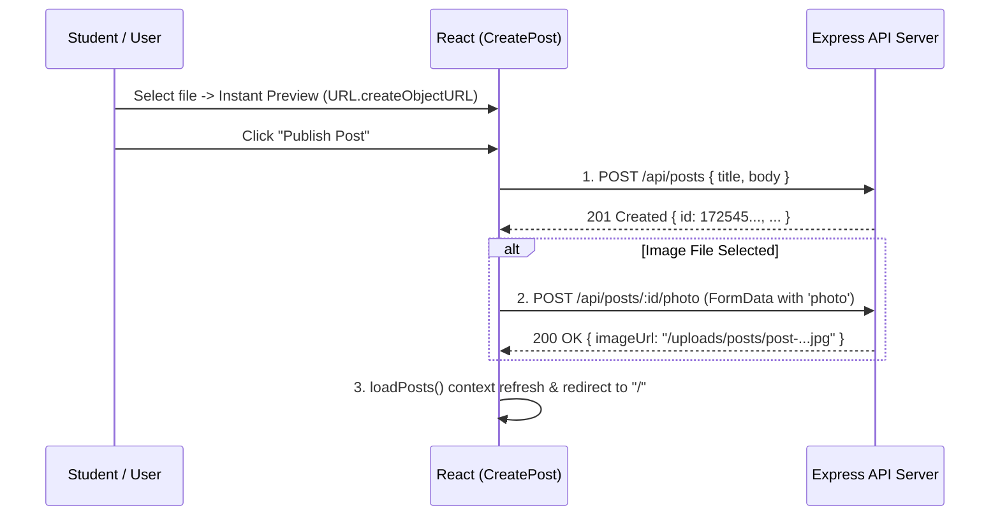

# Social App (React + Vite)

A modern social feed application built with React, React Router, Tailwind CSS, and a RESTful API service layer utilizing the native browser **Fetch API** to communicate with the backend server (`social-app-api-server`).

---

## 📌 Features

- **Real Photo Upload & Instant Preview (New)**:
  - **File Upload Inputs**: Replaced plain `imageUrl` text boxes in both `CreatePost` and `EditPost` with actual file picker inputs (`<input type="file" accept="image/*">`).
  - **Instant Client-Side Preview**: Utilizes `URL.createObjectURL(file)` to render an instant thumbnail preview before form submission, complete with a single-click remove button.
  - **2-Step Post Creation Workflow**: Creates the post via `POST /api/posts` to obtain its unique ID, then uploads the selected image file to `POST /api/posts/:id/photo` via `multipart/form-data`.
  - **Edit Post Image Replacement**: Allows authors to preview existing images and upload a replacement file that automatically overwrites the previous image on the backend.
  - **URL Resolver (`getImageUrl`) & Vite Dev Proxy**: Automatically resolves relative `/uploads/posts/...` backend paths to the Express server origin, reinforced with a Vite proxy for `/uploads`.
- **Error Handling & 404 Catch-All Routing**:
  - **404 Not Found Page (`<NotFound>`)**: Automatically renders a beginner-friendly 404 page for any undefined URL route using React Router catch-all (`path="*"`) matching. Includes clear navigation to return to the Home page.
- **Authentication & Protected Routes**:
  - Sign Up (Registration) with name, username, email, password, and bio (`POST /api/auth/register`).
  - Log In with email/password validation (`POST /api/auth/login`).
  - Active session check (`GET /api/auth/me`).
  - Session termination / Logout (`POST /api/auth/logout`).
  - **Auth Redirects & Protected Routes (`<ProtectedRoute>`)**: Automatically redirects unauthenticated guests to `/login` when accessing protected pages.
  - Active session handling via **React Context API** (`AuthContext`) and custom `useAuth()` hook.
  - Top Navigation profile badge (avatar, user name, and logout button).
- **Real-Time Post Search Bar**:
  - Controlled input search bar on Home feed and Saved Posts pages.
  - Filters posts on the fly using case-insensitive title and content matching.
  - Displays empty search result indicator when no posts match query terms.
- **Post Ownership & Management Actions**:
  - Post owners can **Edit** post titles, contents, and image URLs.
  - Post owners can **Delete** posts. Deleting a post removes it from the server database along with its associated comments.
  - Author actions are verified using the authenticated user's ID against the post author's ID.
- **Bookmarks / Saved Posts**:
  - Users can save/bookmark posts.
  - A dedicated **Saved Posts** page (`/saved`) lists all bookmarked posts of the user.
- **Global Post Management Context (`PostContext`)**:
  - Manages global state for posts (`posts`) and loader flags (`isLoading`).
  - Offers custom hook `usePosts()` providing `posts`, `savedPosts`, `deletePost()`, `toggleLike()`, and `toggleSave()`.
  - Simplifies component updates: toggling like or save reactively updates the UI across pages immediately.
- **Interactive Post Actions**:
  - `isLiked`: Tracks whether the active user liked a post (`POST /api/posts/:id/like`).
  - `isSaved`: Tracks personal bookmarks (`POST /api/posts/:id/save`).
  - Real-time like counter updates.
  - Commenting system per post with user attribution (`GET /api/posts/:postId/comments`, `POST /api/posts/:postId/comments`).
- **Users Management (CRUD)**:
  - Read all users (`GET /api/users`).
  - Read single user (`GET /api/users/:id`).
  - Update user profile (`PUT /api/users/:id`).
  - Delete user (`DELETE /api/users/:id`).

---

## 🚦 Application Routes Table

| Path             | Component    | Protected | Description                                             |
| :--------------- | :----------- | :-------: | :------------------------------------------------------ |
| `/`              | `Home`       |    Yes    | Main feed displaying recent posts with real-time search |
| `/create-post`   | `CreatePost` |    Yes    | Form page to create a new post                          |
| `/edit-post/:id` | `EditPost`   |    Yes    | Form page to update an existing owned post              |
| `/saved`         | `SavedPosts` |    Yes    | Collection of bookmarked/saved posts                    |
| `/post/:id`      | `DetailPost` |    No     | Post detail view and comments section                   |
| `/login`         | `Login`      |    No     | User authentication login form                          |
| `/signup`        | `Signup`     |    No     | User registration signup form                           |
| `*`              | `NotFound`   |    No     | Catch-all 404 route for non-existent paths              |

---

## 🚀 Getting Started

### Prerequisites

- **Node.js**: `v18.x` or higher
- **npm**: `v9.x` or higher

### 1. Environment Configuration

Create a `.env` file in the root directory (or copy from `.env.example`):

```bash
cp .env.example .env
```

Set the backend server URL:

```env
VITE_API_URL=http://localhost:5000/api
```

### 2. Backend Server Setup & Run

In a separate terminal, navigate to the API server directory and start the Express server:

```bash
cd "../social-app-api-server"
npm install
node server.js
```

The backend API server will run at `http://localhost:5000`.

### 3. Frontend Client Setup & Run

In the `social-app` directory:

```bash
cd social-app

# Install project dependencies
npm install

# Start Vite development server
npm run dev
```

The frontend application will be accessible at `http://localhost:5173`.

---

## 🌐 API Service Layer (`src/services/api.js`)

All client-side HTTP network requests are organized in [`src/services/api.js`](file:///media/thura/DATA/My%20Folders/Code with Thura/Courses/Fullstack Live Class/Projects/Vite Project/social-app/src/services/api.js) using the native browser `fetch` API.

---

## 📸 Photo Upload Architecture & Beginner Teaching Guide

This application demonstrates how to handle actual file uploads in a modern React frontend connected to an Express/Multer backend.

### 1. The 2-Step Post Creation with Upload Flow (`CreatePost.jsx`)

Because a post requires a server-assigned `id` to associate its uploaded image (`/uploads/posts/post-<id>.<ext>`), the client performs a clean 2-step async sequence:



### 2. Post Edit & Overwrite Flow (`EditPost.jsx`)

When editing an existing post:
1. `EditPost` loads the post by `:id`, displaying the current photo via `getImageUrl(currentImageUrl)`.
2. The user can select a new photo. When selected, a new preview is shown alongside a *"Keep Current Photo"* cancel button.
3. Upon submission:
   - Text fields are updated via `PUT /api/posts/:id`.
   - If a new photo file was chosen, it is sent to `POST /api/posts/:id/photo`. The backend's deterministic ID-based storage automatically deletes the old file and writes the new file as `post-<id>.<ext>`, preventing server disk bloat.

### 3. Key Concepts for Beginners

| Concept | Explanation |
| :--- | :--- |
| **`FormData` Object** | Used to construct `multipart/form-data` payloads required for binary file uploads (`formData.append("photo", file)`). |
| **Omitting `Content-Type` Header** | **Crucial teaching point:** Never set `"Content-Type": "multipart/form-data"` manually in `fetch`! The browser automatically computes the boundary delimiter (e.g. `boundary=----WebKitFormBoundary...`). Manual setting breaks the request! |
| **`URL.createObjectURL(file)`** | Creates a temporary DOM string pointing to the file stored in browser memory, enabling instantaneous image previews before uploading. |
| **`URL.revokeObjectURL(previewUrl)`** | Cleans up the in-memory object URL when the user removes or replaces the image, preventing browser memory leaks. |
| **`getImageUrl(url)` Resolver** | Safely maps relative backend file paths (`/uploads/posts/post-1.png`) to `http://localhost:5000/uploads/posts/post-1.png`, while leaving full external URLs (`https://images.unsplash.com/...`) untouched. |
| **Vite Dev Proxy** | Configured in `vite.config.js` (`proxy: { "/uploads": "http://localhost:5000" }`) to ensure static images route to the backend server even without full URLs. |

---

## 🛡️ Global React Context & Error Handling

### 1. `ErrorBoundary.jsx`

React Class Component implementing `getDerivedStateFromError` and `componentDidCatch` to prevent application crashes caused by rendering runtime errors.

### 2. `NotFound.jsx` (404 Page)

Renders a user-friendly 404 message when navigating to unrecognized paths (caught by `path="*"` route in `App.jsx`).

### 3. `AuthContext.jsx`

Manages user sessions, registration, login, and logout. Custom hook: `useAuth()`.

### 4. `PostContext.jsx`

Manages posts loading, likes, saves, and deletions. Custom hook: `usePosts()`.

---

## 🛠️ Project Directory Structure

```text
social-app/
├── public/
├── src/
│   ├── components/
│   │   ├── CommentSession.jsx  # Comments list & submission form
│   │   ├── ErrorBoundary.jsx   # Global React Error Boundary component (New)
│   │   ├── Navbar.jsx          # Top navigation with home & saved post links
│   │   ├── PostCard.jsx        # Stateless Post card UI connected to PostContext
│   │   └── ProtectedRoute.jsx  # Auth redirect wrapper for protected routes
│   ├── context/
│   │   ├── AuthContext.jsx     # User authentication Context & hook
│   │   └── PostContext.jsx     # Global posts Context (like, save, delete, savedPosts)
│   ├── pages/
│   │   ├── CreatePost.jsx      # Protected Post creation form
│   │   ├── DetailPost.jsx      # Post detail view (consumes PostContext dynamically)
│   │   ├── EditPost.jsx        # Edit post details form
│   │   ├── Home.jsx            # Feed / Recent posts page with Search Bar
│   │   ├── Login.jsx           # Login page
│   │   ├── NotFound.jsx        # 404 Not Found Page component (New)
│   │   ├── SavedPosts.jsx      # Lists user saved posts with Search Bar
│   │   └── Signup.jsx          # Sign Up page
│   ├── services/
│   │   └── api.js              # RESTful API client (Fetch API CRUD layer)
│   ├── App.jsx                 # App router, ProtectedRoute, ErrorBoundary, AuthProvider, & PostProvider
│   ├── main.jsx                # React root mount
│   └── index.css               # Tailwind CSS entrypoint
├── .env.example                # Environment variable reference
├── package.json
├── vite.config.js
└── README.md
```

---

# API Documentation

စမ်းသပ်အသုံးပြုရန် Base URL: `[https://api.codewiththura.com/](https://api.codewiththura.com/)`

> **ဥပမာ -** Post တွေကို ရယူလိုပါက:
> `GET [https://api.codewiththura.com/api/posts](https://api.codewiththura.com/api/posts)`

---

### Authentication

| Method | Endpoint | Description |
| --- | --- | --- |
| `POST` | `/api/auth/register` | Register a new user account |
| `POST` | `/api/auth/login` | Log in to user account |
| `GET` | `/api/auth/me` | Fetch currently authenticated user info |
| `POST` | `/api/auth/logout` | Log out active user session |

---

### Posts

| Method | Endpoint | Description |
| --- | --- | --- |
| `GET` | `/api/posts` | Get all posts (can filter by `userId` query param) |
| `GET` | `/api/posts/:id` | Get a specific post by ID |
| `POST` | `/api/posts` | Create a new post |
| `PUT` | `/api/posts/:id` | Update an existing post |
| `DELETE` | `/api/posts/:id` | Delete a post and its comments |
| `POST` | `/api/posts/:id/archive` | Archive or unarchive a post |
| `POST` | `/api/posts/:id/like` | Like or unlike a post |
| `POST` | `/api/posts/:id/save` | Save or unsave a post |

---

### Comments

| Method | Endpoint | Description |
| --- | --- | --- |
| `GET` | `/api/posts/:postId/comments` | Get comments for a specific post |
| `POST` | `/api/posts/:postId/comments` | Add a comment to a specific post |

---

### Photo Uploads

* **Upload Profile Picture:**
* `POST /api/users/:id/photo`
* *Aliases:* `/api/users/:id/avatar`, `/api/upload/user/:id`


* **Upload Post Picture:**
* `POST /api/posts/:id/photo`
* *Aliases:* `/api/posts/:id/image`, `/api/upload/post/:id`


---

### Users

| Method | Endpoint | Description |
| --- | --- | --- |
| `GET` | `/api/users` | Get all users |
| `GET` | `/api/users/:id` | Get a specific user by ID |
| `PUT` | `/api/users/:id` | Update a user's profile |
| `DELETE` | `/api/users/:id` | Delete a user |

---

### Demo Accounts

| Email | Password |
| --- | --- |
| `thura@example.com` | `password123` |
| `maythin@example.com` | `password123` |


